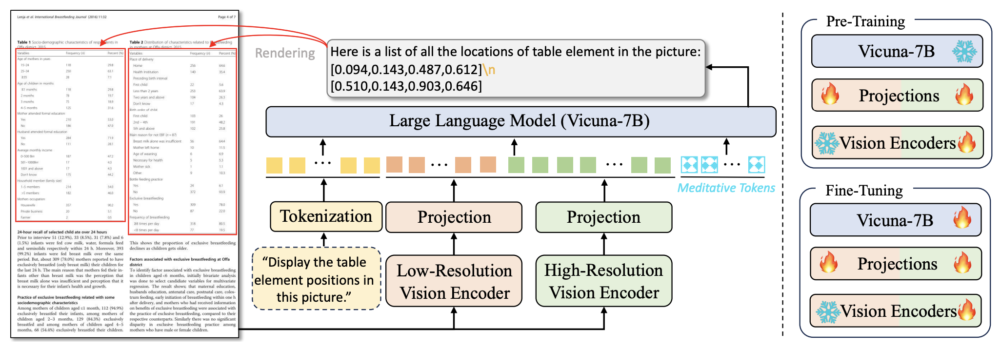

 # TabPedia: Towards Comprehensive Visual Table Understanding with Concept Synergy
<p align="center">
    
</p>

<p align="center">
     📃 <a href="https://arxiv.org/pdf/2406.01326" target="_blank">Paper</a> | 🤗 <a href="https://huggingface.co/datasets/ByteDance/ComTQA" target="_blank">ComTQA Dataset</a> | 🤗 <a href="https://huggingface.co/Zhaowc/TabPedia_v1.0/tree/main" target="_blank">TabPedia_v1.0</a>

</p>

## News

- [2024/08/27] 🔥 The training code is coming soon.
- [2024/08/27] 🔥 Released inference code for visual table understanding tasks. Due to company copyright restrictions, we utilize [InternLM-7B-chat](https://huggingface.co/internlm/internlm2-chat-7b) as the LLM.

## Installation
- This codebase is tested on CUDA 11.8 and A100-SXM-80G.
    ```bash
    conda create -n TabPedia python=3.10 -y && conda activate TabPedia
    pip install torch==2.0.1 torchvision==0.15.2 torchaudio==2.0.2 --index-url https://download.pytorch.org/whl/cu118
    pip install packaging &&  pip install ninja && pip install flash-attn==2.3.6 --no-build-isolation --no-cache-dir
    pip install -r requirements.txt
    git clone https://github.com/InternLM/xtuner.git -b v0.1.15
    cd xtuner
    pip install -e '.[all]'
    ```

## Quick Start

* You need to download the official ViT-L/224 from [🤗 Huggingface](https://huggingface.co/openai/clip-vit-large-patch14/tree/main) and save it into ``./pretrained_pth/CLIP-ViT-Large``.
* You need to download our pretrained model from [🤗 TabPedia_v1.0](https://huggingface.co/Zhaowc/TabPedia_v1.0) and save it into ``./pretrained_pth``.
* Change the configuration of **CLIP_L_224px_pretrained_pth** and **llm_name_or_path** in ``tools/configs/Internlm2_7b_chat_TabPedia.py``
* Finally, you can perform evaluation shell to coduct prediction. The results could be found in ``./results``.
    ```bash
    bash eval_TabPedia.sh
    ```

## Citation

If you find this work useful, please consider citing our paper:
```
@inproceedings{zhao2024tabpedia,
 title={TabPedia: Towards Comprehensive Visual Table Understanding with Concept Synergy},
 author = {Weichao Zhao, Hao Feng, Qi Liu, Jingqun Tang, Binghong Wu, Lei Liao, Shu Wei, Yongjie Ye, Hao Liu, Wengang Zhou, Houqiang Li, Can Huang},
 booktitle = {Advances in Neural Information Processing Systems},
 year = {2024}
}
```

## Acknowledgement
- [Xtuner](https://github.com/InternLM/xtuner): the codebase we built upon. 


